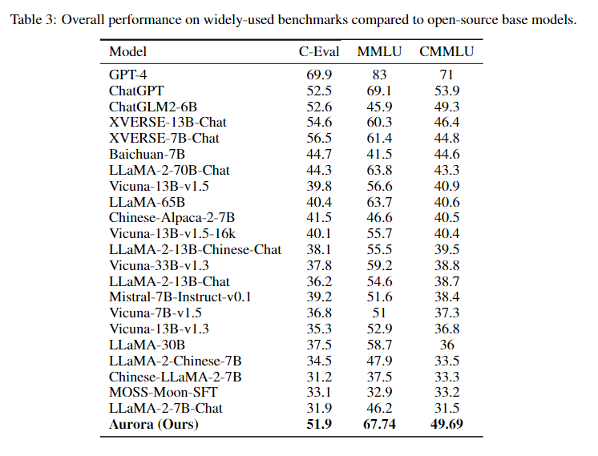
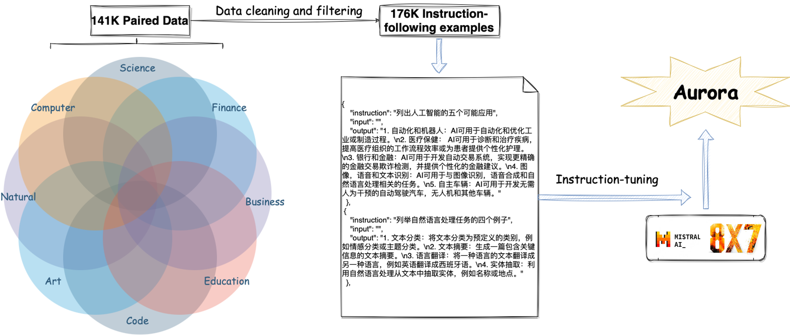
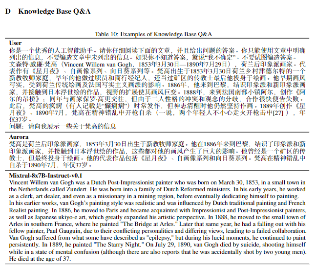
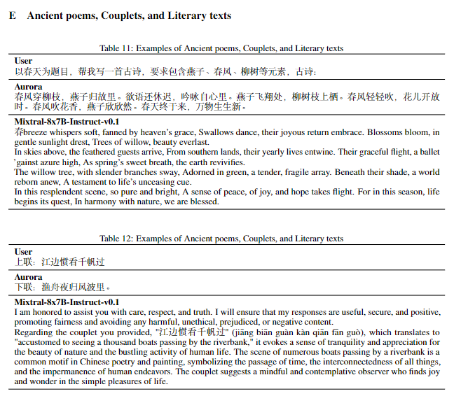
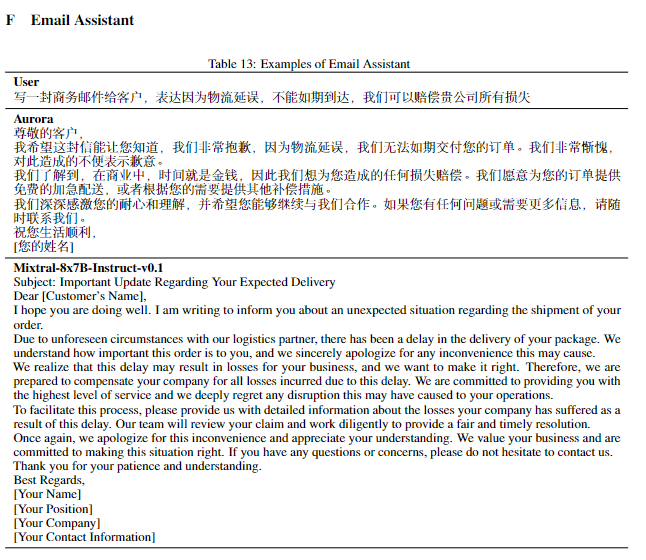
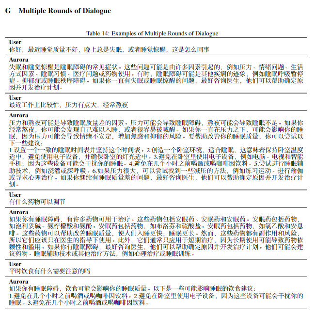
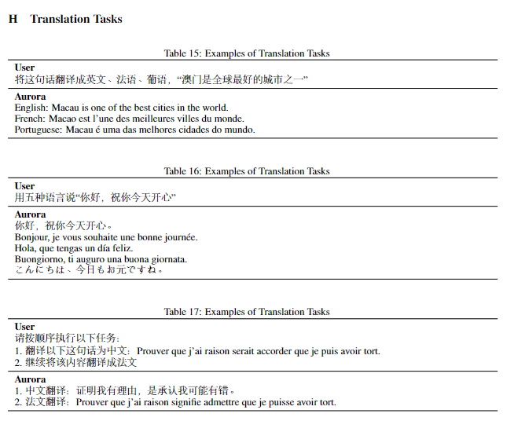
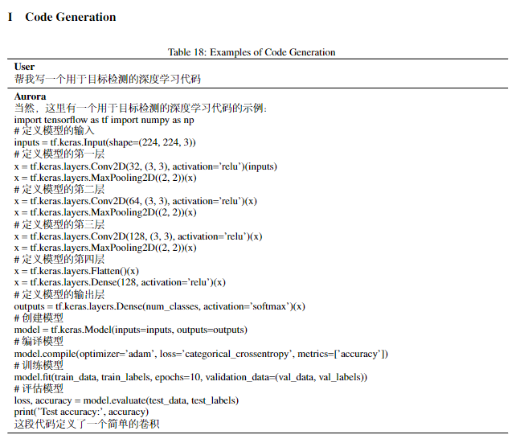

<div align="center">
<h2>
  Aurora: Activating chinese chat capability for Mixtral-8x7B sparse Mixture-of-Experts through Instruction-Tuning
</h2>
</div>

<!--

> [!NOTE]
> We apologize for the misnaming of the paper due to our mistake: `Mixtral-8x7B-Instruct-v0.1` was incorrectly named `Mistral-8x7B`, and `Mix` and `Mis` do not seem to be the same thing. **We will make a correction in the next release**.

-->

***Rongsheng Wang**, Haoming Chen, Ruizhe Zhou, Yaofei Duan, Kunyan Cai, Han Ma, Jiaxi Cui, Jian Li, Patrick Cheong-Iao Pang, Yapeng Wang, Tao Tan☨*

☨Corresponding author

<h5 align="center">

<a href='https://arxiv.org/abs/2312.14557'></a>  <a href='https://huggingface.co/wangrongsheng/Aurora'></a>

</h5>


## Overview

Existing research has demonstrated that refining large language models (LLMs) through the utilization of machine-generated instruction-following data empowers these models to exhibit impressive zero-shot capabilities for novel tasks, without requiring human-authored instructions. In this paper, we systematically investigate, preprocess, and integrate three Chinese instruction-following datasets with the aim of enhancing the Chinese conversational capabilities of Mixtral-8x7B sparse Mixture-of-Experts model. Through instruction fine-tuning on this carefully processed dataset, we successfully construct the Mixtral-8x7B sparse Mixture-of-Experts model named "Aurora." To assess the performance of Aurora, we utilize three widely recognized benchmark tests: C-Eval, MMLU, and CMMLU. Empirical studies validate the effectiveness of instruction fine-tuning applied to Mixtral-8x7B sparse Mixture-of-Experts model. This work is pioneering in the execution of instruction fine-tuning on a sparse expert-mixed model, marking a significant breakthrough in enhancing the capabilities of this model architecture.

## Evaluation

It is known that LLM evaluation remains a significant challenge. We use three public benchmarks in our study.



Scores of different checkpoints on BLEU and ROUGE.

|Model Checkpoints|BLEU-4|ROUGE-1|ROUGE-2|ROUGE-l|
|:-|:-|:-|:-|:-|
|checkpoints-6000|18.4134|38.2669|18.9526|26.572|
|checkpoints-8000|18.3351|38.4327|19.058|26.6573|
|checkpoints-8000|18.5638|38.5497|19.1992|26.8305|
|checkpoints-12000|18.7156|38.7787|19.3347|27.0613|
|checkpoints-14000|18.5194|38.6898|19.2032|26.8863|

Aurora's performance was tested in the medical evaluation benchmark [CMB](https://cmedbenchmark.llmzoo.com/)

|Model|Avg. Scores|
|:-|:-|
|Aurora|29.87|
|Mistral-7B|22.26|

<details>
<summary>More details</summary>

```json
{
    "accuracy_per_category": {
        "医师考试": 0.305,
        "护理考试": 0.33875,
        "药师考试": 0.289375,
        "医技考试": 0.30666666666666664,
        "专业知识考试": 0.27875,
        "医学考研": 0.27625
    },
    "accuracy_per_subcategory": {
        "医师考试": {
            "规培结业": 0.295,
            "执业助理医师": 0.3175,
            "执业医师": 0.3375,
            "中级职称": 0.3125,
            "高级职称": 0.2625
        },
        "护理考试": {
            "护士执业资格": 0.4,
            "护师执业资格": 0.325,
            "主管护师": 0.355,
            "高级护师": 0.275
        },
        "药师考试": {
            "执业西药师": 0.3075,
            "执业中药师": 0.2925,
            "初级药士": 0.325,
            "初级药师": 0.2925,
            "初级中药士": 0.2475,
            "初级中药师": 0.2775,
            "主管药师": 0.305,
            "主管中药师": 0.2675
        },
        "医技考试": {
            "医技士": 0.31,
            "医技师": 0.2775,
            "主管技师": 0.3325
        },
        "专业知识考试": {
            "基础医学": 0.25,
            "临床医学": 0.27,
            "预防医学与公共卫生学": 0.3575,
            "中医学与中药学": 0.2375
        },
        "医学考研": {
            "护理学": 0.2475,
            "考研政治": 0.3225,
            "西医综合": 0.2925,
            "中医综合": 0.2425
        }
    }
}
```

</details>

<!--
|Model|[CMMLU](https://opencompass.org.cn/dataset-detail/CMMLU)|[MMLU](https://opencompass.org.cn/dataset-detail/MMLU)|[C-EVAL](https://opencompass.org.cn/dataset-detail/C-Eval)|
|:-|:-|:-|:-|
|Aurora(checkpoints-3000)|**49.69**|**67.74**|**51.9**|
|LLaMA-2-70B-Chat|43.3|63.8|44.3|
|LLaMA-65B|40.4|63.7|40.6|
-->

<!--CMMLU：**Average: 49.69**</br>STEM: 44.69</br>Social Sciences: 52.03</br>Humanities: 49.14</br>Other: 51.58-->
<!--MMLU：**Average: 67.74**</br>STEM: 57.53</br>Social Sciences: 77.42</br>Humanities: 63.34</br>Other: 74.41-->

Next are some references we gave you about GPU memory usage during the training and inference stage. **Please note that we did all inference and training on a single GPU.**

|Stage|GPU Memory Usage|
|:-|:-|
|Training|~43 GiB|
|Inference|~25 GiB|

## Quick-Use

Thanks to the inference code from [@fouvy](https://github.com/fouvy), now you can quickly use Aurora with the following code.

<details>
<summary>Inference with Gradio</summary>

```python
import gradio as gr
import torch
from transformers import AutoModelForCausalLM, AutoTokenizer, StoppingCriteria, StoppingCriteriaList, TextIteratorStreamer
from threading import Thread
from peft import PeftModel
import time

# download base model weights
# https://huggingface.co/mistralai/Mixtral-8x7B-Instruct-v0.1
# or
# https://modelscope.cn/models/AI-ModelScope/Mixtral-8x7B-Instruct-v0.1
model_name_or_path = "mistralai/Mixtral-8x7B-Instruct-v0.1"

# download lora model weights
# https://huggingface.co/wangrongsheng/Aurora
# or
# https://modelscope.cn/models/wangrongsheng/Aurora-Mixtral-8x7B
lora_weights = "wangrongsheng/Aurora"

tokenizer = AutoTokenizer.from_pretrained(model_name_or_path)
model0 = AutoModelForCausalLM.from_pretrained(model_name_or_path, load_in_4bit=True, device_map="auto", torch_dtype=torch.bfloat16)
model = PeftModel.from_pretrained(
    model0,
    lora_weights,
)

class StopOnTokens(StoppingCriteria):
    def __call__(self, input_ids: torch.LongTensor, scores: torch.FloatTensor, **kwargs) -> bool:
        stop_ids = [0,]
        for stop_id in stop_ids:
            if input_ids[0][-1] == stop_id:
                return True
        return False

def convert_history_to_text(history):
    text = ""
    if len(history) > 1:
        text = "<s> " + "".join(
                [
                    "".join(
                        [
                            f"[INST]{item[0]}[/INST] {item[1]} ",
                        ]
                    )
                    for item in history[:-1]
                ]
            ) + "</s> "
    text += "".join(
        [
            "".join(
                [
                    f"[INST]{history[-1][0]}[/INST]",
                ]
            )
        ]
    )
    return text

def predict(message, history):
    history_transformer_format = history + [[message, ""]]
    stop = StopOnTokens()

    messages = convert_history_to_text(history_transformer_format)

    model_inputs = tokenizer([messages], return_tensors="pt").to("cuda")
    streamer = TextIteratorStreamer(tokenizer, timeout=10., skip_prompt=True, skip_special_tokens=True)
    generate_kwargs = dict(
        model_inputs,
        streamer=streamer,
        max_new_tokens=4096,
        do_sample=True,
        top_p=0.95,
        top_k=1000,
        temperature=1.0,
        num_beams=1,
        pad_token_id=tokenizer.eos_token_id,
        stopping_criteria=StoppingCriteriaList([stop])
        )
    t = Thread(target=model.generate, kwargs=generate_kwargs)
    t.start()

    partial_message  = ""
    t1 = time.time()
    count = 0
    for new_token in streamer:
        if new_token != '<':
            partial_message += new_token
            count += 1
            yield partial_message
    t2 = time.time()
    speed = count/(t2-t1)
    print("inference speed: %f tok/s" % speed)

gr.ChatInterface(predict,chatbot=gr.Chatbot(height=600,),title="MoE").queue().launch()
```

```html
Test 1 (Mixtral-8x7B-Instruct-v0.1)
inference speed: 13.004695 tok/s
After inference:
+---------------------------------------------------------------------------------------+
| Processes:                                                                            |
|  GPU   GI   CI        PID   Type   Process name                            GPU Memory |
|        ID   ID                                                             Usage      |
|=======================================================================================|
|    0   N/A  N/A    639547      C   python                                    12230MiB |
|    3   N/A  N/A    639547      C   python                                    15450MiB |
+---------------------------------------------------------------------------------------+

Test 2 (Aurora-Mixtral-8x7B + Mixtral-8x7B-Instruct-v0.1)
inference speed: 11.221806 tok/s
After inference:
+---------------------------------------------------------------------------------------+
| Processes:                                                                            |
|  GPU   GI   CI        PID   Type   Process name                            GPU Memory |
|        ID   ID                                                             Usage      |
|=======================================================================================|
|    0   N/A  N/A    640109      C   python                                    12196MiB |
|    3   N/A  N/A    640109      C   python                                    15406MiB |
+---------------------------------------------------------------------------------------+
```

</details>

## Easy-to-Use

#### 1. Clone and Set up

```git
https://github.com/WangRongsheng/Aurora.git
cd Aurora
pip install -r requirements.txt
```

#### 2. Download Model

*Base Model*:
|Model|Download|
|:-|:-|
|Mixtral-8x7B-Instruct-v0.1|[[HuggingFace](https://huggingface.co/mistralai/Mixtral-8x7B-Instruct-v0.1/tree/125c431e2ff41a156b9f9076f744d2f35dd6e67a)] [[HuggingFace-mirror](https://hf-mirror.com/mistralai/Mixtral-8x7B-Instruct-v0.1/tree/125c431e2ff41a156b9f9076f744d2f35dd6e67a)] [[ModelScope](https://modelscope.cn/models/AI-ModelScope/Mixtral-8x7B-Instruct-v0.1/files)]|

*LoRA Model*:
|Model|Download|
|:-|:-|
|Aurora|[[HuggingFace](https://doi.org/10.57967/hf/1556)] [[ModelScope](https://modelscope.cn/models/wangrongsheng/Aurora-Mixtral-8x7B/summary)] [[WiseModel](https://wisemodel.cn/models/wangrongsheng/Aurora-Mixtral-8x7B/intro)]|
|Aurora-PLus|[[HuggingFace](https://doi.org/10.57967/hf/1580)] [[ModelScope]()] [[WiseModel]()]|

> [!NOTE]
> Aurora-Plus is a **bilingual Chinese and English** MoE model that we highly recommend for any testing!

> The huge model parameters are not convenient for you to manage your task, so we provide LoRA weights, which will be merged with the base model before inference. You don't have to worry about it.

#### 3. Inference

*Web*:
```python
CUDA_VISIBLE_DEVICES=0 python src/web_demo.py \
    --model_name_or_path ./Mixtral-8x7B-Instruct-v0.1 \
    --checkpoint_dir Aurora \
    --finetuning_type lora \
    --quantization_bit 4 \
    --template mistral
```
Then you can visit: http://127.0.0.1:7860/

*CLI*:
```python
CUDA_VISIBLE_DEVICES=0 python src/cli_demo.py \
    --model_name_or_path ./Mixtral-8x7B-Instruct-v0.1 \
    --checkpoint_dir Aurora \
    --finetuning_type lora \
    --quantization_bit 4 \
    --template mistral
```

*API*:
```python
CUDA_VISIBLE_DEVICES=0 python src/api_demo.py \
    --model_name_or_path ./Mixtral-8x7B-Instruct-v0.1 \
    --checkpoint_dir Aurora \
    --finetuning_type lora \
    --quantization_bit 4 \
    --template mistral
```

If you need to load weights for specific checkpoints, you can set them up like this: `--checkpoint_dir Aurora/checkpoint-6000`.

## Train



If you have a single GPU and its GPU memory size is larger than 48GB, you can train your own models.

<details>
<summary>Train your MoE model</summary>
  
```python
CUDA_VISIBLE_DEVICES=5 python   src/train_bash.py \
    --stage sft \
    --model_name_or_path ./Mixtral-8x7B-Instruct-v0.1 \
    --do_train \
    --dataset alpaca_zh,alpaca_gpt4_zh,sharegpt \
    --finetuning_type lora \
    --quantization_bit 4 \
    --overwrite_cache \
    --output_dir output/ \
    --per_device_train_batch_size 2 \
    --gradient_accumulation_steps 4 \
    --lr_scheduler_type cosine \
    --logging_steps 100 \
    --save_steps 1000 \
    --learning_rate 5e-5 \
    --num_train_epochs 3.0 \
    --plot_loss \
    --fp16 \
    --template mistral \
    --lora_target q_proj,v_proj
```

`--quantization_bit 4` means you will use `QLoRA`, If you have a larger GPU memory size you can remove it and use `LoRA`.

</details>

<details>
<summary>Evaluation your MoE model</summary>
  
```python
CUDA_VISIBLE_DEVICES=0 python src/evaluate.py \
    --model_name_or_path ./Mixtral-8x7B-Instruct-v0.1 \
    --checkpoint_dir Aurora/checkpoint-5000 \
    --finetuning_type lora \
    --quantization_bit 4 \
    --template mistral \
    --task cmmlu \ # cmmlu, mmlu, ceval
    --split test \
    --lang en \ # zh, en
    --n_shot 5 \
    --batch_size 8
```

</details>

## Results









## Acknowledgments

This work is mainly done by the [Faculty of Applied Sciences](https://www.mpu.edu.mo/esca/zh/index.php) of the Macao Polytechnic University. The computational resources used in this work were obtained from AWS servers. The fine-tuning framework we used is [LLaMA-Factory](https://github.com/hiyouga/LLaMA-Factory), which brings a lot of convenience to our work. We also thank the public datasets from the open source community, such as [shareAI](https://huggingface.co/shareAI), [stanford_alpaca](https://github.com/tatsu-lab/stanford_alpaca) and [GPT-4-LLM](https://github.com/Instruction-Tuning-with-GPT-4/GPT-4-LLM). Most importantly we are very grateful to [Mistral AI](https://mistral.ai/), who are leading a new technology boom that will dramatically change the future of technology development.

## Citation
If you find our work helpful, feel free to give us a cite.
```bib
@misc{wang2023auroraactivating,
      title={Aurora:Activating Chinese chat capability for Mixtral-8x7B sparse Mixture-of-Experts through Instruction-Tuning}, 
      author={Rongsheng Wang and Haoming Chen and Ruizhe Zhou and Yaofei Duan and Kunyan Cai and Han Ma and Jiaxi Cui and Jian Li and Patrick Cheong-Iao Pang and Yapeng Wang and Tao Tan},
      year={2023},
      eprint={2312.14557},
      archivePrefix={arXiv},
      primaryClass={cs.CL}
}
```

## License
Please follow the [Apache 2.0 License](https://github.com/WangRongsheng/Aurora/blob/main/LICENSE).
